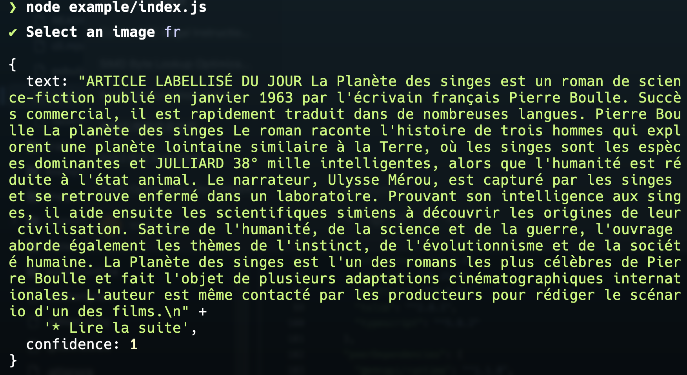

# `@napi-rs/system-ocr`


> OCR library that uses system provided API. `VisionKit` on macOS, `Media OCR` on Windows.

## Example

```js
node example/index.js
```

| Example                      | Result                      |
| ---------------------------- | --------------------------- |
|  |     |
|  |  |

## Usage

### Install

```
pnpm add @napi-rs/system-ocr
yarn install @napi-rs/system-ocr
npm install @napi-rs/system-ocr
```

### API

```ts
import { recognize } from '@napi-rs/system-ocr'

const result = await recognize('path/to/image.png')
```

```ts
import { recognize, OcrAccuracy } from '@napi-rs/system-ocr'

const image = await fetch('https://example.com/image.png')

const result = await recognize(image, OcrAccuracy.Accurate, ['fr', 'zh-cn'])
```
